# vscode Debug 設定

1. 下載 MinGW 並依預設值安裝在 C:\MinGW 內  
MinGW 是 C/C++ 的編譯器。  
下載網址: https://sourceforge.net/projects/mingw/

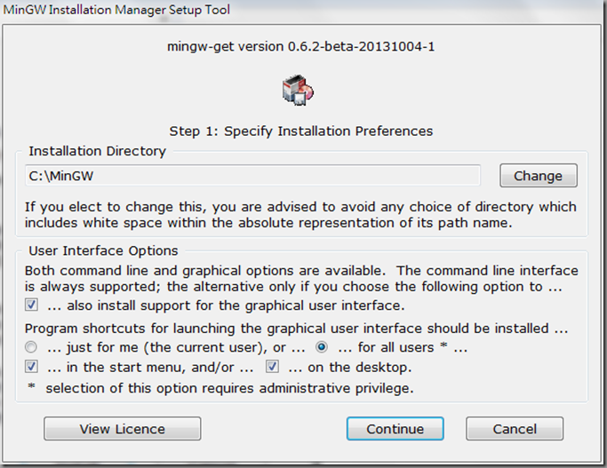

Mark for Install:選擇 mingw32-gcc-g++
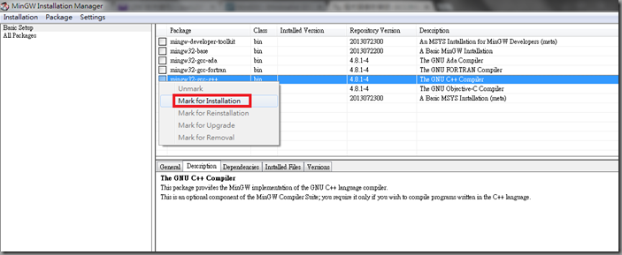

Apply Changes
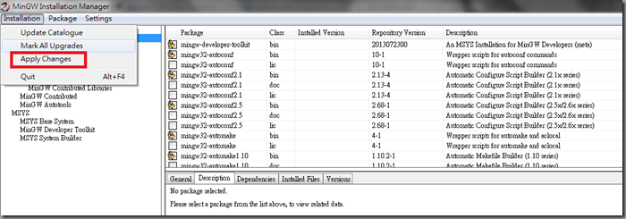

設定環境變數
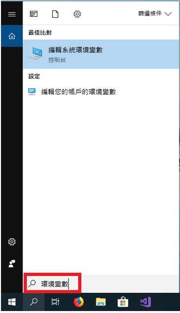

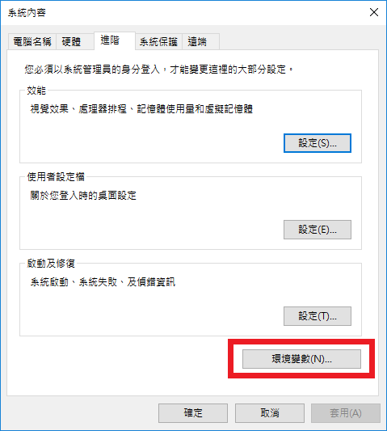

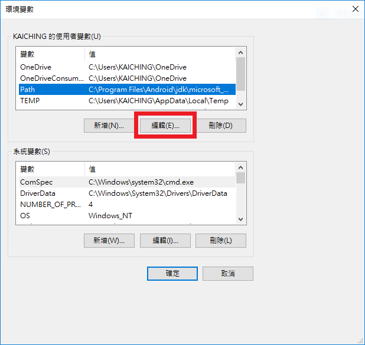

增加一筆紀錄 C:\MinGW\bin  
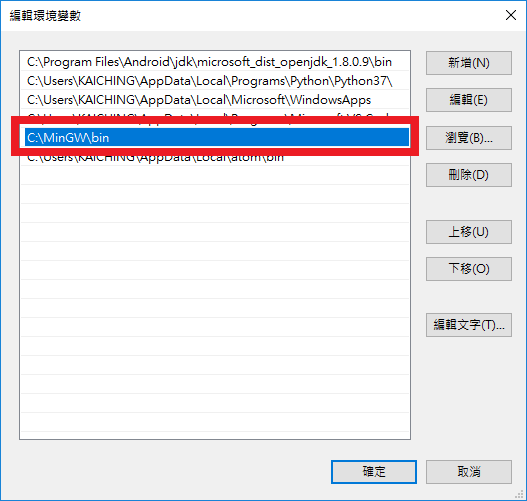

2. 安裝 VSCode  
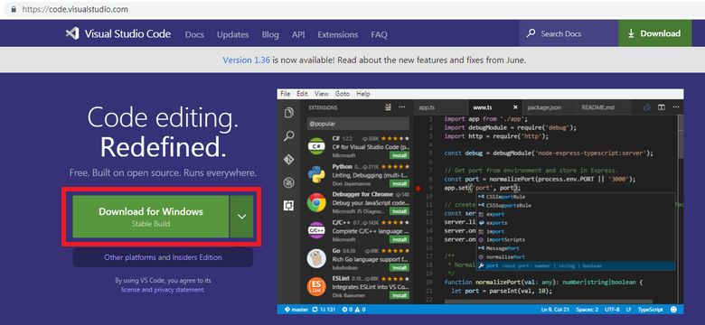

3. 下載 CPP 專案設定檔
   https://github.com/jiangsir/VScode_Debug

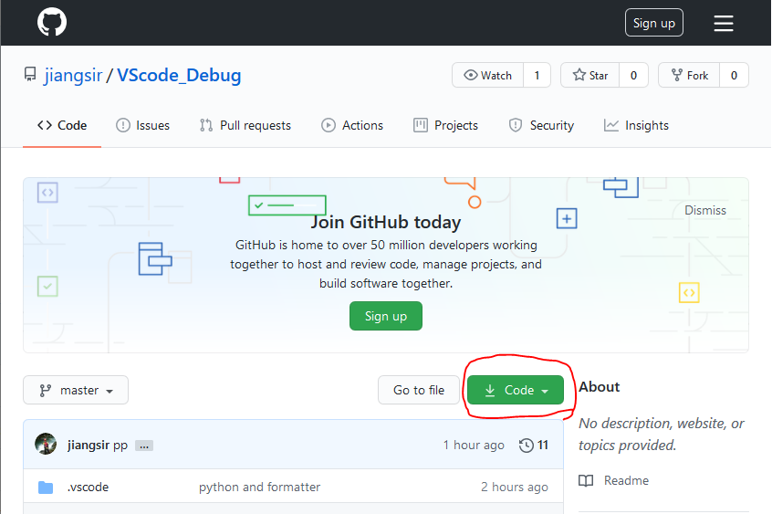

解開後，直接讓 VScode 開啟資料夾即可開始進行開發。  

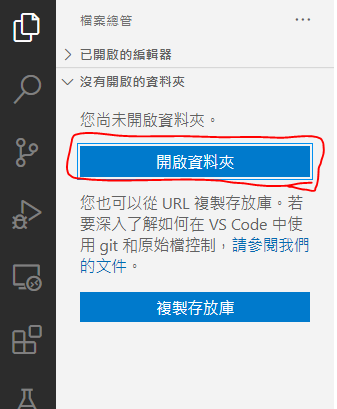

檔案結構如下:  
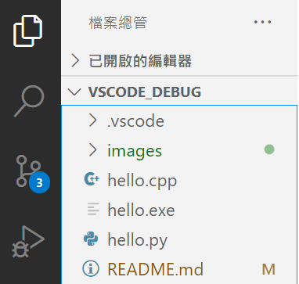

點開 hello.cpp 就可以開始進行開發與 Debug

4. 進行 Debug  
	
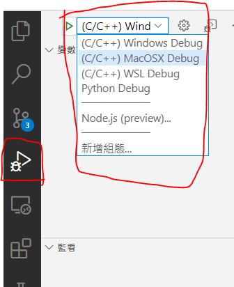

選擇除錯的項目之後就可以直接用 F5 進行除錯。  

用滑鼠在行號左邊點一下就可以設定好中斷點  
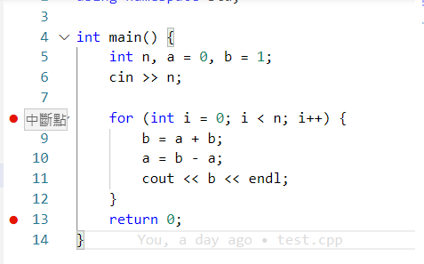

彈出一個 "命令提示字元" 可以提供鍵盤輸入  
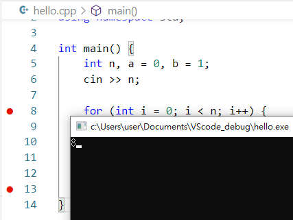

可以按 F10 開始一步一步執行  
或者 F11 進入函數  
或者 F5 執行到下個中斷點  
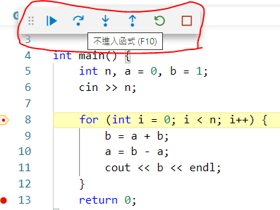

在左邊就可以觀察變數的變化情形了。
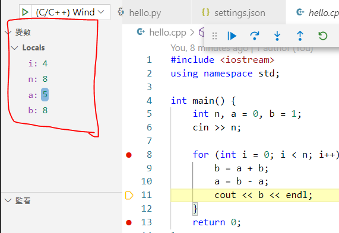
